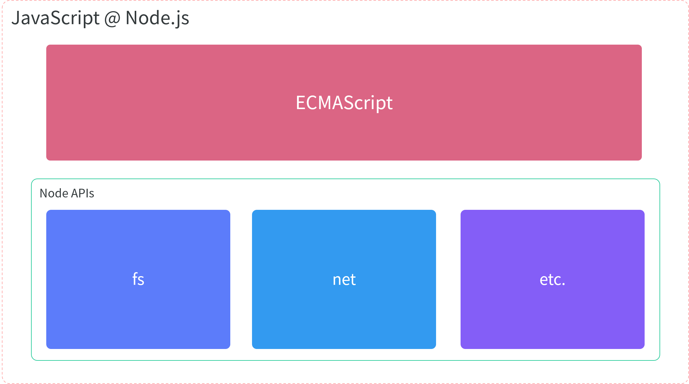

# 直播课：20200819 
## Node.js 补充介绍

> 目前前端开发中 Node.js 的定位？

### Node 是什么？

~~框架，库，语言~~

Node.js 是一个 JavaScript 运行平台 / 运行时。

### 什么是平台 / 运行时？

运行时通俗来说就是运行环境，我们所开发的应用程序大都运行在某个运行环境之上。

e.g.

- Web 应用：代码 → React → Browser → Windows
- Node 应用：代码 → Express → Node.js → Linux

定义：平台⼀般就是指⼀个运⾏环境

作⽤：开发者可以使⽤指定语⾔，基于这个环境开发应⽤

> 换个⻆度：**平台就是为编程语⾔「赋能」，让编程语⾔具备实际「能⼒」**

### Node.js 可以做什么？

平台的作⽤就是提供「舞台」，所以理论上平台没有绝对只能⼲什么的说法

不同的平台在提供 APIs 不同，所以我们能够做的事情也不同

e.g.浏览器作为⼀个运⾏环境

- 能够使⽤ JS 操作界⾯上的 DOM 元素
- 无法通过 JavaScript 代码实现⽤户本地磁盘⽂件的读写

但是每个平台都有各⾃的特点，这些特点决定了它更适合做什么事情

- 技术⻆度：Node.js 平台的特点是⾮阻塞 IO，所以适合处理⾼并发请求
- ⼈员⻆度：Node.js 平台采⽤的语⾔是 JavaScript，适合前端开发者使⽤

综上结论：

- Node.js 适合开发服务器端的应⽤层（BFF）
  
- Node.js 适合⽤于开发前端⽅向的各种⼯具
  - 脚手架工具
  - 自动化工具
  - 构建 / 打包工具
  - 本地测试工具
  - etc.

## 基于 CAZ 的模板 / 脚手架工具开发

> 参考链接：https://github.com/zce/caz

### CAZ 相关介绍

## CAZ 源码分析

> 参考链接：https://github.com/zce/caz
